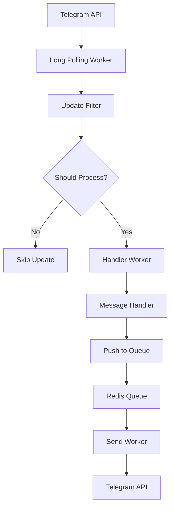

# Архитектура и ключевые решения

## Обзор

Telegram-бот на PHP с веб-панелью управления, использующий:
- Минималистичный HTTP-слой на Slim 4
- Две зоны маршрутов: API (`/api/*`) и Dashboard (`/dashboard/*`)
- Без ORM: прямой PDO с подготовленными выражениями
- Защита: JWT, CSRF, Rate-Limit, Security Headers, ограничение размера тела запроса, RFC 7807
- Фоновые воркеры: long polling Telegram, обработчик обновлений, планировщик рассылок, утилитарные задачи
- Redis (опционально): хранение сессий, очередей, кэширования и фильтрации апдейтов
- Интеграция с GPT через AITunnel API
- Система промокодов и рефералов
- Docker для развертывания

## Поток обработки запроса

1. Вход в `public/index.php`, загрузка `.env`, сборка `config`
2. Создание Slim-приложения и регистрация Middleware (сверху вниз):
   - `RequestIdMiddleware` — X-Request-Id, корреляция логов
   - `RequestSizeLimitMiddleware` — защита от слишком больших тел
   - `BodyParsingMiddleware` — парсинг JSON/форм-данных
   - `SecurityHeadersMiddleware` — CORS + базовый CSP + X-Headers
   - `ErrorMiddleware` — единый обработчик ошибок (RFC 7807 JSON)
3. Группы маршрутов:
   - Dashboard `/dashboard/*`: сессии + CSRF + Auth (логин/логаут, UI-функции)
   - API `/api/*`: JWT + Rate-Limit (REST эндпоинты)
4. Ответ сериализуется через `Helpers\Response` (json / problem+json)

## Контроллеры

- `Controllers\Dashboard\*` — страницы панели (Messages, Files, Updates, Users, Logs, и т. п.). Работают с сессией и CSRF.
- `Controllers\Api\*` — Health, Auth (login/refresh), Me, Users. Работают с JWT и возвращают JSON.

## Middleware

- `ErrorMiddleware(bool $debug)` — преобразует исключения в RFC 7807 (при debug — расширенная диагностика)
- `RequestIdMiddleware` — генерирует/передаёт `X-Request-Id`
- `RequestSizeLimitMiddleware(int $bytes)` — 413 при превышении лимита тела
- `SecurityHeadersMiddleware` — CORS (origins/methods/headers), CSP (script/style/font/connect), безопасные заголовки
- `SessionMiddleware` — поддержка сессий для Dashboard
- `CsrfMiddleware` — CSRF-токены в формах Dashboard
- `JwtMiddleware` — валидация JWT для защищённых API-маршрутов
- `RateLimitMiddleware` — лимиты на IP/пользователя
- `TelegramInitDataMiddleware($botToken)` — проверка подписи `initData` из Telegram Mini App
- `AuthMiddleware` — проверка авторизации в Dashboard

## Хелперы и сервисы

- `Database` — singleton PDO
- `Response` — json/problem ответы
- `Logger` — обёртка над Monolog
- `Push` — отправка сообщений в Telegram (включая группы медиа)
- `MediaBuilder` — удобная сборка `InputMedia*` для групп медиа
- `RedisHelper`/`RedisKeyHelper` — доступ к Redis и ключам
- `RefreshTokenService` — управление refresh-токенами
- `MessageStorage`, `FileService`, `Path`, `View`, `JsonHelper` — вспомогательные утилиты
- `Telemetry` — заглушка/точка расширения для метрик/трейсинга
- `GPTService` — интеграция с AITunnel API
- `Scheduled` — планирование рассылок
- `PromoCodeHelper` — работа с промокодами

## Telegram: обработка обновлений

### Архитектура обработки

Telegram-бот использует архитектуру с разделением на несколько компонентов:

1. **Long Polling Worker** (`workers/longpolling.php`) - получает обновления от Telegram API
2. **Update Filter** (`app/Telegram/UpdateFilter.php`) - фильтрует обновления по типам, чатам и командам
3. **Handler Worker** (`workers/handler.php`) - обрабатывает конкретные обновления в отдельных процессах
4. **Message Handlers** (`app/Handlers/Telegram/*`) - обрабатывают конкретные типы сообщений
5. **Push System** - ставит сообщения в очередь через Redis для последующей отправки

### Поток обработки



### Фильтрация обновлений

Фильтрация может быть настроена через:
- Переменные окружения (`TG_ALLOW_UPDATES`, `TG_DENY_UPDATES`, `TG_ALLOW_CHATS`, `TG_DENY_CHATS`, `TG_ALLOW_COMMANDS`, `TG_DENY_COMMANDS`)
- Redis-множества (если `TG_FILTERS_FROM_REDIS=true`):
  - `tg:filters:allow_updates`
  - `tg:filters:deny_updates`
  - `tg:filters:allow_chats`
  - `tg:filters:deny_chats`
  - `tg:filters:allow_commands`
  - `tg:filters:deny_commands`

### Поддерживаемые типы обновлений

- `message` - текстовые сообщения
- `edited_message` - редактированные сообщения
- `channel_post` - посты в каналах
- `edited_channel_post` - редактированные посты в каналах
- `message_reaction` - реакции на сообщения
- `message_reaction_count` - счетчики реакций
- `inline_query` - инлайн-запросы
- `chosen_inline_result` - выбранные инлайн-результаты
- `callback_query` - callback-запросы
- `shipping_query` - запросы доставки
- `pre_checkout_query` - запросы предоплаты
- `poll` - опросы
- `poll_answer` - ответы на опросы
- `my_chat_member` - изменения статуса бота в чате
- `chat_member` - изменения участников чата
- `chat_join_request` - запросы на вступление в чат
- `chat_boost` - бусты чата
- `removed_chat_boost` - удаленные бусты чата

## Структура базы данных

### Основные таблицы

#### Пользователи панели
```sql
CREATE TABLE `users` (
    `id` INT UNSIGNED AUTO_INCREMENT PRIMARY KEY,
    `email` VARCHAR(320) DEFAULT NULL,
    `password` VARCHAR(255) DEFAULT NULL,
    `telegram_user_id` BIGINT DEFAULT NULL,
    `created_at` TIMESTAMP NOT NULL DEFAULT CURRENT_TIMESTAMP,
    `updated_at` TIMESTAMP NOT NULL DEFAULT CURRENT_TIMESTAMP ON UPDATE CURRENT_TIMESTAMP
);
```

#### Пользователи Telegram
```sql
CREATE TABLE `telegram_users` (
    `id` INT UNSIGNED AUTO_INCREMENT PRIMARY KEY,
    `user_id` BIGINT UNSIGNED NOT NULL,
    `username` VARCHAR(32),
    `first_name` VARCHAR(64),
    `last_name` VARCHAR(64),
    `language_code` VARCHAR(10),
    `is_premium` TINYINT(1) NOT NULL DEFAULT 0,
    `is_user_banned` TINYINT(1) NOT NULL DEFAULT 0,
    `is_bot_banned` TINYINT(1) NOT NULL DEFAULT 0,
    `is_subscribed` TINYINT(1) NOT NULL DEFAULT 0,
    `referral_code` VARCHAR(32),
    `invited_user_id` BIGINT UNSIGNED,
    `utm` VARCHAR(255),
    `created_at` TIMESTAMP NOT NULL DEFAULT CURRENT_TIMESTAMP,
    `updated_at` TIMESTAMP NOT NULL DEFAULT CURRENT_TIMESTAMP ON UPDATE CURRENT_TIMESTAMP
);
```

#### Обновления Telegram
```sql
CREATE TABLE `telegram_updates` (
    `id` INT UNSIGNED AUTO_INCREMENT PRIMARY KEY,
    `update_id` BIGINT UNIQUE NOT NULL,
    `user_id` BIGINT UNSIGNED NOT NULL,
    `message_id` BIGINT UNSIGNED DEFAULT NULL,
    `type` VARCHAR(50) NOT NULL,
    `data` JSON NOT NULL,
    `sent_at` TIMESTAMP DEFAULT NULL,
    `created_at` TIMESTAMP NOT NULL DEFAULT CURRENT_TIMESTAMP,
    CHECK (JSON_VALID(data))
);
```

#### Очередь сообщений
```sql
CREATE TABLE `telegram_messages` (
    `id` BIGINT UNSIGNED AUTO_INCREMENT PRIMARY KEY,
    `user_id` BIGINT UNSIGNED DEFAULT NULL,
    `method` VARCHAR(255) NOT NULL,
    `type` VARCHAR(255) DEFAULT NULL,
    `scheduled_id` BIGINT UNSIGNED DEFAULT NULL,
    `data` JSON NOT NULL,
    `priority` TINYINT(1) DEFAULT 0,
    `status` ENUM('pending','processing','success','failed','retry') NOT NULL DEFAULT 'pending',
    `error` TEXT,
    `code` VARCHAR(64),
    `message_id` BIGINT UNSIGNED,
    `response` JSON,
    `processed_at` TIMESTAMP NULL DEFAULT NULL,
    `created_at` TIMESTAMP NOT NULL DEFAULT CURRENT_TIMESTAMP,
    CHECK (JSON_VALID(data)),
    CHECK (JSON_VALID(response))
);
```

#### Запланированные сообщения
```sql
CREATE TABLE `telegram_scheduled_messages` (
    `id` BIGINT UNSIGNED AUTO_INCREMENT PRIMARY KEY,
    `user_id` BIGINT UNSIGNED DEFAULT NULL,
    `method` VARCHAR(255) NOT NULL,
    `type` VARCHAR(255) DEFAULT NULL,
    `data` JSON NOT NULL,
    `priority` TINYINT(1) DEFAULT 0,
    `send_after` TIMESTAMP NOT NULL,
    `status` ENUM('pending','processing','success','failed','canceled') NOT NULL DEFAULT 'pending',
    `target_type` ENUM('all','group','selected') DEFAULT NULL,
    `target_group_id` INT UNSIGNED DEFAULT NULL,
    `selected_count` INT UNSIGNED DEFAULT 0,
    `success_count` INT UNSIGNED DEFAULT 0,
    `failed_count` INT UNSIGNED DEFAULT 0,
    `canceled_at` TIMESTAMP NULL DEFAULT NULL,
    `started_at` TIMESTAMP NULL DEFAULT NULL,
    `completed_at` TIMESTAMP NULL DEFAULT NULL,
    `created_at` TIMESTAMP NOT NULL DEFAULT CURRENT_TIMESTAMP,
    CHECK (JSON_VALID(data))
);
```

#### Сессии Telegram
```sql
CREATE TABLE `telegram_sessions` (
    `id` INT UNSIGNED AUTO_INCREMENT PRIMARY KEY,
    `user_id` BIGINT UNSIGNED NOT NULL,
    `session_id` VARCHAR(128) NOT NULL,
    `data` JSON NOT NULL,
    `created_at` TIMESTAMP NOT NULL DEFAULT CURRENT_TIMESTAMP,
    `updated_at` TIMESTAMP NOT NULL DEFAULT CURRENT_TIMESTAMP ON UPDATE CURRENT_TIMESTAMP,
    CHECK (JSON_VALID(data))
);
```

#### Refresh токены
```sql
CREATE TABLE `refresh_tokens` (
    `id` INT UNSIGNED AUTO_INCREMENT PRIMARY KEY,
    `user_id` INT UNSIGNED NOT NULL,
    `token_hash` VARCHAR(64) NOT NULL,
    `jti` VARCHAR(36) NOT NULL,
    `expires_at` INT NOT NULL,
    `revoked` TINYINT(1) NOT NULL DEFAULT 0,
    `created_at` TIMESTAMP NOT NULL DEFAULT CURRENT_TIMESTAMP
);
```

#### Промокоды
```sql
CREATE TABLE `promo_code_batches` (
    `id` INT UNSIGNED AUTO_INCREMENT PRIMARY KEY,
    `filename` VARCHAR(255) NOT NULL,
    `created_by` INT UNSIGNED DEFAULT NULL,
    `total` INT UNSIGNED NOT NULL DEFAULT 0,
    `created_at` TIMESTAMP NOT NULL DEFAULT CURRENT_TIMESTAMP
);

CREATE TABLE `promo_codes` (
    `id` INT UNSIGNED AUTO_INCREMENT PRIMARY KEY,
    `batch_id` INT UNSIGNED NOT NULL,
    `code` VARCHAR(255) NOT NULL,
    `status` ENUM('available','issued','expired') NOT NULL DEFAULT 'available',
    `expires_at` TIMESTAMP NULL DEFAULT NULL,
    `issued_at` TIMESTAMP NULL DEFAULT NULL,
    `created_at` TIMESTAMP NOT NULL DEFAULT CURRENT_TIMESTAMP
);

CREATE TABLE `promo_code_issues` (
    `id` INT UNSIGNED AUTO_INCREMENT PRIMARY KEY,
    `code_id` INT UNSIGNED NOT NULL,
    `telegram_user_id` BIGINT UNSIGNED NOT NULL,
    `issued_by` INT UNSIGNED DEFAULT NULL,
    `issued_at` TIMESTAMP NOT NULL DEFAULT CURRENT_TIMESTAMP
);
```

#### Рефералы
```sql
CREATE TABLE `referrals` (
    `id` INT UNSIGNED AUTO_INCREMENT PRIMARY KEY,
    `inviter_user_id` BIGINT UNSIGNED NOT NULL,
    `invitee_user_id` BIGINT UNSIGNED NOT NULL,
    `via_code` VARCHAR(32) DEFAULT NULL,
    `created_at` TIMESTAMP NOT NULL DEFAULT CURRENT_TIMESTAMP
);
```

## Система веб-панели

### Аутентификация

Веб-панель использует сессионную аутентификацию:
1. Пользователь вводит email/пароль на `/dashboard/login`
2. Контроллер `AuthController` проверяет учетные данные
3. При успешной аутентификации создается сессия с `user_id`
4. Middleware `AuthMiddleware` проверяет наличие `user_id` в сессии

### JWT API

API использует JWT-токены:
1. Пользователь отправляет учетные данные на `/api/auth/login`
2. Контроллер `AuthController` проверяет учетные данные
3. Генерируется JWT-токен с refresh-токеном
4. Middleware `JwtMiddleware` проверяет JWT в заголовке `Authorization: Bearer`

### Структура интерфейса

Веб-панель использует шаблонизатор PHP с layout-системой:
- `templates/layouts/main.php` - основной layout
- `templates/layouts/centered.php` - центрированный layout для логина
- `templates/dashboard/*` - шаблоны страниц панели
- `templates/partials/*` - частичные шаблоны

## Система GPT

### Архитектура

GPT-интеграция реализована через:
1. `GPTService` - обертка над AITunnel API
2. `workers/gpt.php` - воркер обработки задач
3. Redis-очередь для задач и результатов

### Circuit Breaker

`GPTService` реализует паттерн Circuit Breaker:
- При 5 последовательных ошибках переключается в состояние "открыто"
- В открытом состоянии все запросы отклоняются
- Через 30 секунд переключается в "полуоткрытое" состояние
- При успешном запросе переключается в "закрытое" состояние

## Система планирования

### Архитектура

Система планирования реализована через:
1. Таблица `telegram_scheduled_messages` - хранение запланированных сообщений
2. `workers/scheduled.php` - воркер отправки запланированных сообщений
3. `Scheduled` helper - создание запланированных рассылок

### Типы рассылок

1. **Одиночные сообщения** - отправка одному пользователю
2. **Групповые рассылки** - отправка всем пользователям
3. **Целевые рассылки** - отправка группе пользователей
4. **Выборочные рассылки** - отправка определенным пользователям

## Система промокодов

### Архитектура

Система промокодов включает:
1. `promo_code_batches` - батчи промокодов
2. `promo_codes` - сами промокоды
3. `promo_code_issues` - выдачи промокодов

### Функциональность

- Импорт промокодов из CSV
- Выдача промокодов пользователям
- Отслеживание статуса промокодов (доступен/выдан/истек)
- Экспорт истории выдач

## Мониторинг и здоровье

### Health Check

Сервис `HealthService` проверяет:
1. Доступность базы данных
2. Доступность Redis
3. Статус воркеров через Supervisor

### Телеметрия

Класс `Telemetry` предоставляет заглушку для интеграции с системами мониторинга:
- Подсчет отправленных сообщений
- Запись ошибок отправки
- Метрики размера очередей
- Состояние circuit breaker для GPT
- Время ответа GPT

## Docker-инфраструктура

### Сервисы

Docker Compose включает:
- `app` - PHP-FPM приложение
- `nginx` - веб-сервер
- `db` - MySQL база данных
- `redis` - Redis для кэширования и очередей

### Supervisor

Для управления воркерами используется Supervisor:
- `lp` - long polling воркер
- `tg` - группа воркеров обработки обновлений
- `gpt` - группа воркеров GPT
- `scheduled` - воркер планировщика

## Безопасность

### Защита API

1. **JWT** - аутентификация API
2. **Rate Limiting** - ограничение количества запросов
3. **CORS** - контроль источников
4. **CSP** - политика безопасности контента
5. **Security Headers** - безопасные заголовки

### Защита Dashboard

1. **Сессии** - аутентификация пользователей
2. **CSRF** - защита от межсайтовой подделки запросов
3. **Rate Limiting** - ограничение количества запросов

### Защита данных

1. **Хэширование паролей** - bcrypt
2. **Хэширование refresh токенов** - SHA256
3. **Валидация входных данных** - JSON Schema
4. **Ограничение размера запросов** - RequestSizeLimitMiddleware

## Масштабируемость

### Горизонтальное масштабирование

1. **Воркеры** - можно запускать несколько экземпляров
2. **Redis** - используется как брокер сообщений
3. **База данных** - поддерживает репликацию

### Вертикальное масштабирование

1. **Очереди** - приоритизация сообщений
2. **Кэширование** - Redis для часто используемых данных
3. **Индексы** - оптимизация запросов к базе данных

## Производительность

### Оптимизации

1. **Пул соединений** - переиспользование соединений к БД
2. **Кэширование** - Redis для часто используемых данных
3. **Индексы** - оптимизация запросов к базе данных
4. **Пакетная обработка** - обработка сообщений пачками

### Мониторинг производительности

1. **Метрики очередей** - размер очередей в реальном времени
2. **Время ответа** - измерение времени обработки запросов
3. **Количество ошибок** - отслеживание ошибок обработки

## UTM Метки

- Контроллер: `App\\Controllers\\Dashboard\\UtmController`.
- Маршруты: `GET /dashboard/utm`, `POST /dashboard/utm` (в зоне Dashboard с Auth+CSRF+Session).
- Источник данных: сообщение `/start` из чата, связь по `from_user_id` > `telegram_users.user_id`.
- Агрегация: `SUM(total_amount)` по `telegram_users.utm`; пустые UTM заменяются на `(no utm)`.
- Отображение: Суммы платежей по UTM меткам (убывающая сортировка).
